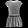

# Image_classification using tensorflow 2 (keras)

This is a quick introduction to use tensorflow for image classification problem. Here are the steps we perform in this colab notebook:

1) Load train and test data 

2) Preprocess the images

3) Train the model on training data with adam optimizer and categorical_crossentropy loss.

4) Get the model predictions on new test images

# Data

Size of train data: 3000 images.

Here are few randomly sampled images from the train data:

# Results

Train accuracy 89.8% with 0.2642 loss

Validation accuracy 87.3% with  0.4302 loss

Note that in the original colab (see reference 1), better accuracy (~92%) is obtained by using ~50000 images. 

# References:

1) https://www.analyticsvidhya.com/blog/2020/03/tensorflow-2-tutorial-deep-learning/
